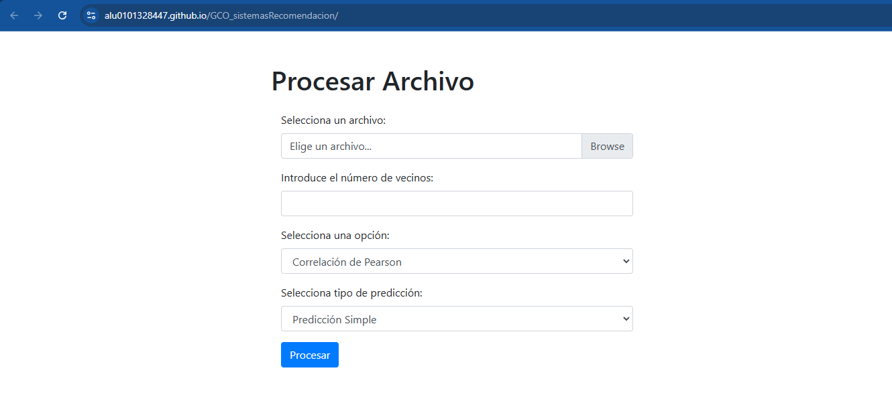
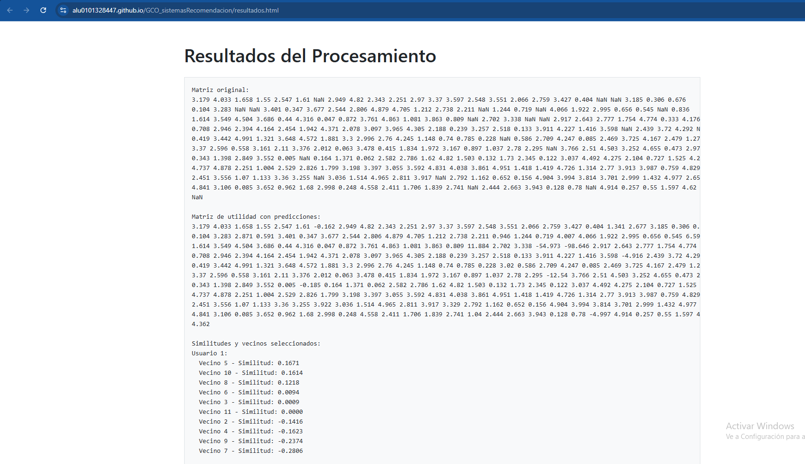

# Gestion del Conocimiento de las Organizaciones: Sistemas de recomendación. Métodos de filtrado colaborativo


**Integrantes del grupo:** 
- Ancor Gonzalez Carballo ([alu0101327679](alu0101327679@ull.edu.es))
- Joel Aday Dorta Hernández ([alu0100987584](alu0100987584@ull.edu.es))
- Jose Pablo Ruiz Galvan ([alu0101328447](alu0101328447@ull.edu.es))
- Jose Javier Ramos Carballo ([alu0101313313](alu0101313313@ull.edu.es))

---

# Índice

1. [Introducción](#1-introducción)
2. [Codigo Desarrollado](#2-codigo-desarrollado)
3. [Ejemplo de Uso](#3-ejemplo-de-uso)
4. [Conclusiones](#4-conclusiones)

---

# 1. Introducción

En esta práctica nos encargaremos de implemntar un sistema de recomendación utilizando metodos de filtrado colaborativo. 
En el, nos encargaremos de realizar una implementación por pagina web, que nos permitirá hacer un analisis sobre la relación entre vecinos,
adaptando los diferentes metodos vistos en las clases de teoria de forma funcional con este codigo.

---

# 2. Codigo Desarrollado

Para empezar, nuestra implementación funciona sobre una pagina web, por tanto, no requerimos de realizar un despliege 
o una secuencia de comandos para utilizar nuestra herramienta.

Sobre esto, distinguimos 2 principales ficheros: [**_index.html_**](../index.html) y [**_resultados.html_**](../resultados.html)

## Index.html

En este fichero nos encargamos tanto de la parte de interaccion del usuario como de realizar los calculos pertinentes.

Para empezar, definimos un encabezado que contiene las diferentes bibliotecas para gestionar el diseño de la pagina con _BootStrap4_ y el manejo de formularios. 

```html

<head>
    <meta charset="UTF-8">
    <meta name="viewport" content="width=device-width, initial-scale=1.0">
    <title>Procesar Archivo</title>
    <!-- Bootstrap CSS desde CDN -->
    <link rel="stylesheet" href="https://stackpath.bootstrapcdn.com/bootstrap/4.5.2/css/bootstrap.min.css">
    <!-- jQuery y Bootstrap JS desde CDN -->
    <script src="https://code.jquery.com/jquery-3.5.1.slim.min.js"></script>
    <script src="https://cdn.jsdelivr.net/npm/@popperjs/core@2.10.2/dist/umd/popper.min.js"></script>
    <script src="https://stackpath.bootstrapcdn.com/bootstrap/4.5.2/js/bootstrap.min.js"></script>
</head>

```

Luego, definimos las opciones del menu, donde implementamos gracias a las librerias definidas, las diferentes opciones que se aplican en la herramienta.

- **_Procesar archivo_**

Con esta opcion, tratamos de poder recoger un fichero de datos que contuviese la matriz de valores, con la que se quiere trabajar.  
Concretamente se preparo para aceptar ficheros de terminación **.txt**

```html

 <div class="container mt-5">
        <h1 class="mb-4">Procesar Archivo</h1>

        <div class="form-group col-md-6">
            <label for="fileInput">Selecciona un archivo:</label>
            <div class="custom-file">
                <input type="file" class="custom-file-input" id="fileInput" accept=".txt" />
                <label class="custom-file-label" for="fileInput">Elige un archivo...</label>
            </div>
        </div>

```

Ademas del codigo escrito en Javascript para poder tratar con el fichero aportado.

```javascript

document.getElementById("fileInput").addEventListener("change", function () {
    const fileName = this.files[0] ? this.files[0].name : "Elige un archivo...";
    const label = this.nextElementSibling;
    label.innerText = fileName;
});

```

- **_Numero de vecinos_**

Con esta opcion, pedimos al usuario el numero de vecinos con los que se quiere realizar el calculo.
Ademas añadimos una restricción que nos pide como minimo escoger al menos un vecino.

```html

<div class="form-group col-md-6">
    <label for="numberInput">Introduce el número de vecinos:</label>
    <input type="number" class="form-control" id="numberInput" min="1" />
</div>

```

- **_Calculo de similitudes_**

Con esta opcion, se puede seleccionar el formato a cerca del calculo de similitudes, donde podemos escoger
las 3 principales implmentaciones que se requerían en la práctica.

```html

        <div class="form-group col-md-6">
            <label for="optionSelect">Selecciona una opción:</label>
            <select class="form-control" id="optionSelect">
                <option value="CorPearson">Correlación de Pearson</option>
                <option value="DistCoseno">Distancia Coseno</option>
                <option value="DistEuclidea">Distancia Euclidiana</option>
            </select>
        </div>

```

1. **Correlación de Pearson**

En esta opcion, calculamos la correlación de Pearson entre los pares de datos.

Para empezar, el codigo se encarga de filtrar los pares para que los datos que lee sean validos, 
solo en ese caso los añade en el par.

Luego, nos encargamos de introducir los valores del par en diferentes arrays, separando el primer valor del par del segundo en diferentes arrays
lo que mas adelante nos permitirá calcular medias, y demas medidas de dispersión. 

Antes de ello, comprobamos si el numero de pares que hemos generado es mayor a 0, dado a que si no se generan pares validos, el valor de la correlación sera 0.

Tras realizar esa comprobación, continuamos calculado las medias de los valores en cada array, y con ello ya podemos calcular ambas partes de la formula de la correlación de Pearson.
Por un lado, nos encargamos de calcular el numerador, y por otro el denominador, comprobando que no de 0. 

```Javascript

 function calcularCorrelacionPearson(x, y) {
    const validPairs = x.reduce((acc, xi, i) => {
        if (!isNaN(xi) && !isNaN(y[i])) {
            acc.push([xi, y[i]]);
        }
        return acc;
    }, []);

    const validX = validPairs.map(pair => pair[0]);
    const validY = validPairs.map(pair => pair[1]);

    const n = validX.length;
    if (n === 0) return 0;

    const meanX = validX.reduce((a, b) => a + b, 0) / n;
    const meanY = validY.reduce((a, b) => a + b, 0) / n;

    let numerator = 0;
    let denominatorX = 0;
    let denominatorY = 0;

    for (let i = 0; i < n; i++) {
        const diffX = validX[i] - meanX;
        const diffY = validY[i] - meanY;

        numerator += diffX * diffY;
        denominatorX += diffX * diffX;
        denominatorY += diffY * diffY;
    }

    const denominator = Math.sqrt(denominatorX) * Math.sqrt(denominatorY);

    return denominator === 0 ? 0 : numerator / denominator;
}

```

2. **Distancia de Coseno**

En esta opcion, calculamos la distancia de coseno entre dos vectores

Para empezar, volvemos a filtrar los pares para que los datos que lee sean validos, solo en ese caso los añade en el par.

Luego, nos encargamos de introducir los valores del par en diferentes arrays, separando el primer valor del par del segundo en diferentes arrays
lo que mas adelante nos permitirá calcular medias, y demas medidas de dispersión. 

Ahora toca calcular el producto punto entre _validA_ y _validB_ sumando el producto de cada par correspondiente, el cual se calcula
con la suma de multiplicar cada elemento de _validA_ con el correspondiente de _validB_.

Antes de teminar con los calculos, debemos calcular la magnitud de _validA_ y _validB_ mediante la suma del cuadrado de cada elemento y luego sacando la raíz cuadrada del total.

Finalmente se operamos para devolver la distancia del coseno a partir de los datos anteriormente calculados.

```Javascript

function calcularDistanciaCoseno(a, b) {
    const validPairs = a.reduce((acc, ai, i) => {
        if (!isNaN(ai) && !isNaN(b[i])) {
            acc.push([ai, b[i]]);
        }
        return acc;
    }, []);

    const validA = validPairs.map(pair => pair[0]);
    const validB = validPairs.map(pair => pair[1]);

    const dotProduct = validA.reduce((sum, ai, i) => sum + ai * validB[i], 0);
    const magnitudeA = Math.sqrt(validA.reduce((sum, ai) => sum + ai * ai, 0));
    const magnitudeB = Math.sqrt(validB.reduce((sum, bi) => sum + bi * bi, 0));

    return (magnitudeA === 0 || magnitudeB === 0) ? 1 : 1 - (dotProduct / (magnitudeA * magnitudeB));
}

```

3. **Distancia Euclidiana**

En esta opcion, calculamos la distancia euclidiana entre dos vectores

Para empezar, volvemos a filtrar los pares para que los datos que lee sean validos, solo en ese caso los añade en el par.

```Javascript

function calcularDistanciaEuclidiana(a, b, predictionType) {
    const validPairs = a.reduce((acc, ai, i) => {
        if (!isNaN(ai) && !isNaN(b[i])) {
            acc.push([ai, b[i]]);
        }
        return acc;
    }, []);

    let sumOfSquares = 0;

    if (predictionType === "Diferencia") {
        const meanA = validPairs.reduce((sum, pair) => sum + pair[0], 0) / validPairs.length;
        const meanB = validPairs.reduce((sum, pair) => sum + pair[1], 0) / validPairs.length;

        sumOfSquares = validPairs.reduce((sum, [ai, bi]) => {
            return sum + Math.pow((ai - meanA) - (bi - meanB), 2);
        }, 0);
    } else if (predictionType === "Simple") {
        sumOfSquares = validPairs.reduce((sum, [ai, bi]) => {
            return sum + Math.pow(ai - bi, 2);
        }, 0);
    }

    const distance = Math.sqrt(sumOfSquares);

    const maxDistance = Math.sqrt(validPairs.length * Math.pow(100, 2)); 
    const normalizedDistance = distance / maxDistance;

    return Math.min(normalizedDistance, 1); 
}

```

- **_Tipo de prediccion_**

Con esta opcion, el usuario puede deducir como se calculan los valores a inferir entre las diferentes implementaciones que hemos realizado para esta práctica.

En la pagina, podemos escoger que tipo de medida se va a utilizar para la inferencia de los datos que faltan.

```html

    <div class="form-group col-md-6">
        <label for="predictionSelect">Selecciona tipo de predicción:</label>
        <select class="form-control" id="predictionSelect">
            <option value="simple">Predicción Simple</option>
            <option value="diferencia">Diferencia con la Media</option>
        </select>
    </div>

```

A nivel de implementación, como pudimos ver en el codigo de la distancia euclidiana, como la implementación se derivaba a 2 posibles formas de calcularlo,
las cuales son las diferentes predicciones que se deben realizar para inferir los datos restantes.

1. **Prediccion mediante la diferencia con la media**

Si la prediccion se realiza con la diferencia de las desviaciones con respecto a las medias, lo que se calculan son las medias de los vectores,
para que mediante la resta de su arreglo, se calcule el cuadrado de la diferencia de los valores.

```Javascript

if (predictionType === "Diferencia") {
    const meanA = validPairs.reduce((sum, pair) => sum + pair[0], 0) / validPairs.length;
    const meanB = validPairs.reduce((sum, pair) => sum + pair[1], 0) / validPairs.length;

    sumOfSquares = validPairs.reduce((sum, [ai, bi]) => {
        return sum + Math.pow((ai - meanA) - (bi - meanB), 2);
    }, 0);
}

```

2. **Prediccion Simple**

Mientras tanto ocurre que si la prediccion simple, se calcula con la suma de los cuadrados de la diferencia entre los valores de cada vector.

```javascript

sumOfSquares = validPairs.reduce((sum, [ai, bi]) => {
    return sum + Math.pow(ai - bi, 2);
}, 0);

```

Una vez con todas las opciones seleccionadas y encargado para realizar los calculos, tenemos el codigo que nos permite realizar todos los calculos
con los parametros y ajustes introducidos.

```javascript

document.getElementById('processButton').addEventListener('click', function () {
    const fileInput = document.getElementById('fileInput');
    const numNeighbors = parseInt(document.getElementById('numberInput').value);
    const option = document.getElementById('optionSelect').value;
    const predictionType = document.getElementById('predictionSelect').value;

    if (fileInput.files.length === 0) {
        alert('Por favor, carga un archivo.');
        return;
    }
    if (isNaN(numNeighbors) || numNeighbors < 1) {
        alert('Por favor, introduce un número de vecinos válido.');
        return;
    }

    const reader = new FileReader();
    reader.onload = function (e) {
        const fileContent = e.target.result.split('\n');
        const minValue = parseFloat(fileContent[0].trim());
        const maxValue = parseFloat(fileContent[1].trim());

        const matrix = fileContent.slice(2).map(line =>
            line.trim().split(' ').map(val => val === '-' ? NaN : parseFloat(val))
        );

        let resultMessage = `Matriz original:\n${matrix.map(row => row.join(' ')).join('\n')}\n\n`;
        const predictions = calcularPredicciones(matrix, numNeighbors, option, predictionType);

        const utilityMatrix = matrix.map((row, i) =>
            row.map((value, j) => isNaN(value) ? predictions[i][j] : value)
        );

        resultMessage += `Matriz de utilidad con predicciones:\n${utilityMatrix.map(row => row.join(' ')).join('\n')}\n\n`;

        const similarityInfo = calcularSimilitudes(matrix, utilityMatrix, numNeighbors, option, predictionType);
        resultMessage += similarityInfo;

        const nombreArchivo = option + '.txt';
        descargarArchivo(nombreArchivo, resultMessage);
        sessionStorage.setItem('resultados', resultMessage);

        window.open('resultados.html', '_blank');
    };

    reader.readAsText(fileInput.files[0]);
});

```

Finalmente ademas de imprimir los resultados por pantalla, adoptamos una funcion que nos permite crear y descargar un archivo de texto con el nombre y contenido especificados. 
Los resultados incluyen la matriz original, la matriz de utilidad con predicciones y las similitudes de vecinos.

```javascript

function descargarArchivo(nombreArchivo, contenido) {
    const blob = new Blob([contenido], { type: 'text/plain' });
    const url = URL.createObjectURL(blob);
    const a = document.createElement('a');
    a.href = url;
    a.download = nombreArchivo;
    document.body.appendChild(a);
    a.click();
    document.body.removeChild(a);
    URL.revokeObjectURL(url);
}

```

## Resultados.html

Con este fichero se trata de recoger los datos obtenidos tras el calculo e imprimirlos por pantalla.

```html

<head>
    <meta charset="UTF-8">
    <meta name="viewport" content="width=device-width, initial-scale=1.0">
    <title>Resultados del Procesamiento</title>
    <!-- Bootstrap CSS desde CDN -->
    <link rel="stylesheet" href="https://stackpath.bootstrapcdn.com/bootstrap/4.5.2/css/bootstrap.min.css">
</head>

<body>

    <div class="container mt-5">
        <h1 class="mb-4">Resultados del Procesamiento</h1>

        <pre class="border p-3" id="resultados" style="background-color: #f8f9fa; color: #212529;">
            No hay resultados disponibles.
        </pre>
    </div>

    <script>
        // Obtener los resultados de sessionStorage
        const resultados = sessionStorage.getItem('resultados');

        if (resultados) {
            document.getElementById('resultados').textContent = resultados;
        } else {
            document.getElementById('resultados').textContent = 'No hay resultados disponibles.';
        }
    </script>

    <!-- jQuery y Bootstrap JS desde CDN -->
    <script src="https://code.jquery.com/jquery-3.5.1.slim.min.js"></script>
    <script src="https://cdn.jsdelivr.net/npm/@popperjs/core@2.10.2/dist/umd/popper.min.js"></script>
    <script src="https://stackpath.bootstrapcdn.com/bootstrap/4.5.2/js/bootstrap.min.js"></script>
</body>

```

---

# 3. Ejemplo de uso

Para poder utilizar nuestra herramienta, debe acceder al siguente [enlace](https://alu0101328447.github.io/GCO_sistemasRecomendacion/), 
y en él, le aparecerá la sigiente pagina



Desde ahi, debemos escoger uno de los ficheros de pruebas aportado en el siguiente [enlace](https://github.com/ull-cs/gestion-conocimiento/tree/main/recommeder-systems/examples-utility-matrices)

Tras ello, debemos puntualizar el resto de opciones:

- **Número de vecinos**, para seleccionar sobre cuantos vecinos se pretende calcular las similitudes
- **Opcion de calculo**, donde se elige las diferentes opciones del calculo  
- **Prediccion**, señala si se quiere realizar el calculo respecto a la diferencia con la media, o mediante una prediccion simple 

Tras seleccionar los ajustes, se accede al calculo, y por un lado aparece la pantalla con el resultado del calculo



Ademas de que automaticamente, se descarga un fichero con el contenido del calculo.

---

# 4. Conclusiones

Finalmente, con este apartado terminamos de explicar y comentar nuestra implementación de un sistemas de recomendación mediante los metodos de filtrado colaborativo.

**_aqui la movida seria meter mas paja de como funciona, a modo de resumen de lo que hemos hablado en el resto de informe_**